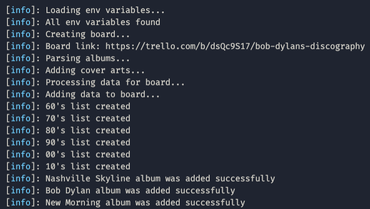
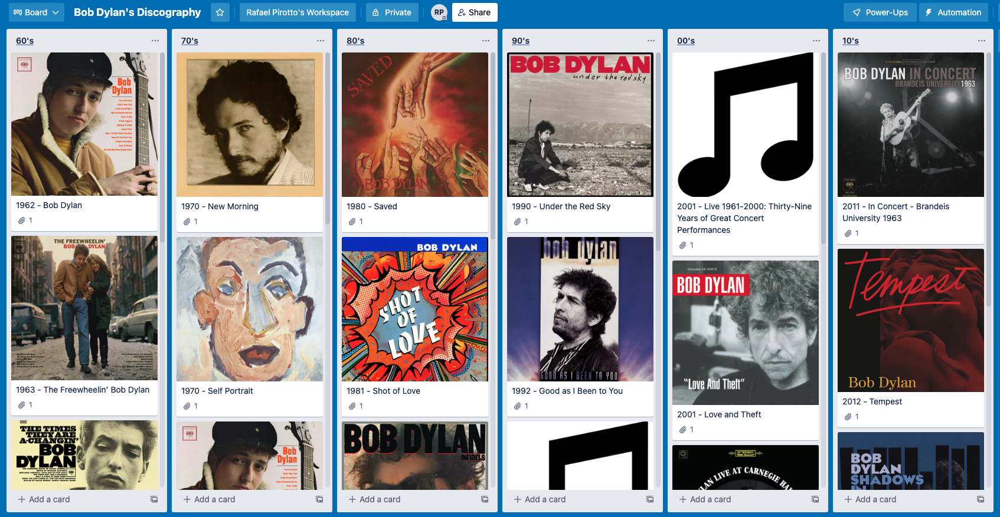

# Bob Dylan's Discography board in Trello

The attached file (`discography.txt`) contains Bob Dylan’s discography. Our goal is to get a Trello board through interacting with the Trello API, with the albums classified in lists sorted by decade. Each album should display its year and title and show up in the list sorted by year, and in the case of same year alphabetically. Additionally, we'd like each album to have the cover art if we can fetch it from Spotify. Your solution should be able to do that from the discography file.

## Contents
1. [Instructions](#instructions)
2. [Environment variables](#environment-variables)
3. [Screenshots](#screenshots)

## Instructions

* Download [zip file](https://github.com/rafapirotto/discography/archive/main.zip) or [clone project](https://github.com/rafapirotto/discography/tree/main)

* Unzip
* Set environment variables using an .env file (see the [Environment variables](#Environment-variables) section)
* Open terminal
* Go to project location
* Run the following commands:

      npm ci
      npm run create-board
    
### Run tests

* Open terminal
* Go to project location
* Run the following command:

      npm test

### Run code coverage 

* Open terminal
* Go to project location
* Run the following command:

      npm run coverage

## Environment variables

The script needs 4 environment variables:
1. `TRELLO_API_KEY`
2. `TRELLO_TOKEN`
3. `SPOTIFY_CLIENT_ID`
4. `SPOTIFY_CLIENT_SECRET`

The trello related variables can be obtained [here](https://trello.com/app-key), while the spotify related ones can be found following [these](https://developer.spotify.com/documentation/general/guides/authorization/app-settings/) instructions.

## Screenshots
### Logger

### Finished board
